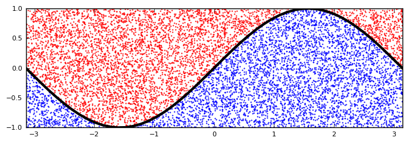
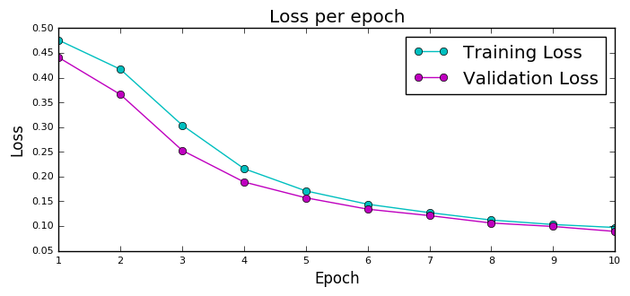
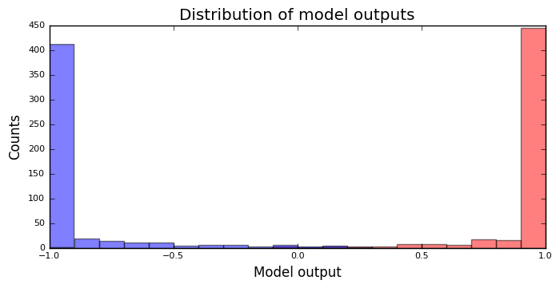
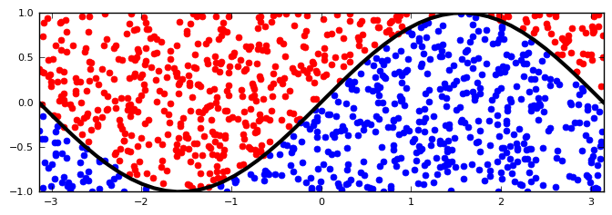

********
Tutorial
********

Alright, you've seen some cool :ref:`the_examples` and now you are asking,
"Okay, so how do I actually make Kur do all these awesome things with my data?"
Let's take a look!

We are going to work through a complete, top-to-bottom model for classifying
2-dimensional points as being above or below a sine curve. I'm going to use
Python with Numpy for some non-Kur code (like generating data) because Python
is awesome. Okay, here's what we need to do:

- Generate our data
- Describe our model
- Run Kur
- Process the outputs

Let's go!

Generate Data
=============

Let's generate 2-dimensional points, where *x* is in [-pi, pi] and *y* is in
[-1, 1]. We'll write a tiny Python script which takes two arguments: the number
of points to generate, and the file to save them to. Here's the script:

.. code-block:: python

	:caption: make_points.py

	import sys
	import pickle
	import numpy

	if len(sys.argv) != 3:
		print(
			'Usage: {} NUM-SAMPLES OUTPUT-FILE'.format(sys.argv[0]),
			file=sys.stderr
		)
		sys.exit(1)

	_, num_samples, output_file = sys.argv
	num_samples = int(num_samples)

	x = numpy.array([
		numpy.random.uniform(-numpy.pi, numpy.pi, num_samples),
		numpy.random.uniform(-1, 1, num_samples)
	]).T
	y = (numpy.sin(x[:,0]) < x[:,1]).astype(numpy.float32) * 2 - 1

	with open(output_file, 'wb') as fh:
		fh.write(pickle.dumps({'point' : x, 'above' : y}))

Alright. Let's make some data!

.. code-block:: bash

	python make_points.py 10000 train.pkl
	python make_points.py 1000 validate.pkl
	python make_points.py 1000 test.pkl
	python make_points.py 1000 evaluate.pkl

Let's make sure everything looks good:

	>>> import pickle
	>>> import numpy
	>>> with open('train.pkl', 'rb') as fh:
	...     data = pickle.loads(fh.read())
	...
	>>> list(data.keys())
	['above', 'point']
	>>> data['point'][:10]
	array([[-1.33519123, -0.89233308],
		   [-1.38182436,  0.30668742],
		   [ 0.43469054,  0.69061382],
		   [ 2.13079098, -0.07026173],
		   [ 0.39899835,  0.83134639],
		   [ 2.09909875, -0.79301865],
		   [ 1.49758186,  0.59398686],
		   [ 2.12582845,  0.41304763],
		   [-2.60369655,  0.63552204],
		   [-0.09503125, -0.63743727]])
	>>> data['above'][:10]
	array([ 1.,  1.,  1., -1.,  1., -1., -1., -1.,  1., -1.], dtype=float32)

Good! Everything looks nice. Let's plot it to make it beautiful (requires
``matplotlib`` be installed).

	>>> import matplotlib.pyplot as plt
	>>> above = data['above'] > 0
	>>> plt.xlim(-numpy.pi, numpy.pi)
	>>> plt.plot(data['point'][above,0], data['point'][above,1], 'ro')
	>>> plt.plot(data['point'][~above,0], data['point'][~above,1], 'bo')
	>>> X = numpy.linspace(-numpy.pi, numpy.pi)
	>>> plt.plot(X, numpy.sin(X), 'k', linewidth=5)
	>>> plt.show()

	Scatter plot of the training set. The input consists of 10,000 random 2D
	points, and the output is whether it is above the sine curve (red points)
	or below the sine curve (blue points).

.. note::

	If you've never used ``matplotlib`` before, it's easy to install. Just do
	this (preferably from your Kur virtual environment):

	.. code-block:: bash

		pip install matplotlib
	
	If you have problems with ``matplotlib`` working out-of-the-box, check out
	our :ref:`troubleshooting page <fix_matplotlib>` for possible solutions.

Describe the Model
==================

So what kind of model should we build? It's a tutorial, so let's build a classic
multi-layer perceptron (MLP) with one hidden layer. This type of model has two
fully-connected layers (input-to-hidden and hidden-to-out), and we will put a
non-linearity after each transformation.

The Model Itself
----------------

Let's start with the ``model`` section of the specification. How big does the
hidden layer need to be? Let's pick something like 128. How big does the last
layer need to be? Just 1, because our output is just scalars (+/- 1, depending
on if the point is above/below the sine curve).

Also, we need to make sure the names of our inputs and outputs in the model
match the names of the data dictionary. We called the inputs ``point`` and we
called the outputs ``above``.

Putting it all together, we realize that our model looks like this:

.. code-block:: yaml

	model:
	  - input: point
	  - dense: 128
	  - activation: tanh
	  - dense: 1
	  - activation: tanh
	    name: above

The Operational Sections
------------------------

Now let's look at the "operational" sections: train, validate, test, evaluate.
The data is all in the same Python pickle format, and for the most part, we can
keep all of the default options. Let's train for ten epochs and, just in case
we want to train multiple times, let's make sure we reload our best-performing
weights (with respect to the validation weights, of course). We will also
specify a log path so we can plot our training loss over time. Our ``train``
section has got to look like this:

.. code-block:: yaml

	train:
	  data:
	    - pickle: train.pkl
	  epochs: 10
	  weights: best.w
	  log: tutorial-log

The ``validate`` section is similar: we want to make sure we save the validation
weights. So it looks like:

.. code-block:: yaml

	validate:
	  data:
	    - pickle: validate.pkl
	  weights: best.w

The ``test`` section is exactly the same, except for the data file, since we
are using the same best-validation weights:

.. code-block:: yaml

	test:
	  data:
	    - pickle: test.pkl
	  weights: best.w

The ``evaluate`` section will also be similar, except we'll want to save the
outputs somewhere.

.. code-block:: yaml

	evaluate:
	  data:
	    - pickle: evaluate.pkl
	  weights: best.w
	  destination: output.pkl

There! That was easy.

The Loss Function
-----------------

The only thing missing is the loss function. What do we want to minimize? Well,
we want the model's outputs the be as close as possible to the true above/below
data. And everything is just scalars. So a really simple loss function to
minimize is mean-squared error.

We also need to assign the loss function to a model output, so we need to make
sure we keep the output names consistent: remember, it's "above", just like we
used in the data files and in the model.

.. code-block:: yaml

	loss:
	  - target: above
	    name: mean_squared_error

Running Kur
===========

Alright, do you have your data? Your specification file (make sure it starts
with ``---`` because it is YAML)? Assuming your specification file is named
``tutorial.yml``, let's train Kur:

.. code-block:: bash

	$ kur train tutorial.yml
	Epoch 1/10, loss=0.476: 100%|█████████████████| 10000/10000 [00:00<00:00, 10684.16samples/s]
	Validating, loss=0.441: 100%|███████████████████| 1000/1000 [00:00<00:00, 11824.73samples/s]

	Epoch 2/10, loss=0.417: 100%|█████████████████| 10000/10000 [00:00<00:00, 88942.65samples/s]
	Validating, loss=0.366: 100%|██████████████████| 1000/1000 [00:00<00:00, 141246.14samples/s]

	Epoch 3/10, loss=0.304: 100%|█████████████████| 10000/10000 [00:00<00:00, 99933.14samples/s]
	Validating, loss=0.253: 100%|██████████████████| 1000/1000 [00:00<00:00, 150043.07samples/s]

	Epoch 4/10, loss=0.216: 100%|████████████████| 10000/10000 [00:00<00:00, 107026.76samples/s]
	Validating, loss=0.189: 100%|██████████████████| 1000/1000 [00:00<00:00, 146561.74samples/s]

	Epoch 5/10, loss=0.171: 100%|████████████████| 10000/10000 [00:00<00:00, 106525.52samples/s]
	Validating, loss=0.157: 100%|██████████████████| 1000/1000 [00:00<00:00, 149454.96samples/s]

	Epoch 6/10, loss=0.144: 100%|████████████████| 10000/10000 [00:00<00:00, 106298.21samples/s]
	Validating, loss=0.134: 100%|██████████████████| 1000/1000 [00:00<00:00, 146546.38samples/s]

	Epoch 7/10, loss=0.127: 100%|████████████████| 10000/10000 [00:00<00:00, 104075.21samples/s]
	Validating, loss=0.121: 100%|██████████████████| 1000/1000 [00:00<00:00, 147780.42samples/s]

	Epoch 8/10, loss=0.112: 100%|████████████████| 10000/10000 [00:00<00:00, 104683.30samples/s]
	Validating, loss=0.106: 100%|██████████████████| 1000/1000 [00:00<00:00, 145443.65samples/s]

	Epoch 9/10, loss=0.103: 100%|████████████████| 10000/10000 [00:00<00:00, 104819.08samples/s]
	Validating, loss=0.099: 100%|██████████████████| 1000/1000 [00:00<00:00, 146623.23samples/s]

	Epoch 10/10, loss=0.097: 100%████████████████| 10000/10000 [00:00<00:00, 105841.40samples/s]
	Validating, loss=0.089: 100%|██████████████████| 1000/1000 [00:00<00:00, 145156.74samples/s]

Everything is training beautifully. We can clearly see that both the training
set and the validation set are being used. Let's use our log data to plot the
loss as a function of epoch! First, let' check what log data is available:

.. code-block:: bash

	$ ls tutorial-log
	training_loss_above
	training_loss_total
	validation_loss_above
	validation_loss_total

Kur is logging the training and validation loss for each output of the model, as
well as the total training and validation loss across all outputs. Our
model only has one output---``above``---so the ``training_loss_above`` and
``training_loss_total`` files are identical (and similarly for the validation
files). Okay, so let's load them:

	>>> from kur.loggers import BinaryLogger
	>>> training_loss = BinaryLogger.load_column('tutorial-log', 'training_loss_total') 
	>>> validation_loss = BinaryLogger.load_column('tutorial-log', 'validation_loss_total') 

Boy, that was simple. Now plot the data:

	>>> import matplotlib.pyplot as plt
	>>> plt.xlabel('Epoch')
	>>> plt.ylabel('Loss')
	>>> epoch = list(range(1, 1+len(training_loss)))
	>>> t_line, = plt.plot(epoch, training_loss, 'co-', label='Training Loss')
	>>> v_line, = plt.plot(epoch, validation_loss, 'mo-', label='Validation Loss')
	>>> plt.legend(handles=[t_line, v_line])
	>>> plt.show()

	Loss per epoch. We can clearly watch both training and validation loss
	decrease over time. Why is the validation loss lower than the training
	loss?  Simple. During training, your weights start out bad and get better
	and better.  But when you run your validation set, you are only using the
	very best weights.  So the weights are in tip-top shape for validation, but
	they are changing during training (so *on average*, they are worse). Of
	course, this is still stochastic: random fluctuations and the exact values
	in the training and validation set will not cause this to happen every
	single time.

Okay, now let's verify that we get comparable loss on our test set:

.. code-block:: bash

	$ kur test tutorial.yml
	Testing, loss=0.087: 100%|███████████████████████| 1000/1000 [00:00<00:00, 1863.51samples/s]

Finally, let's evaluate the model on our evaluation set:

.. code-block:: bash

	$ kur evaluate tutorial.yml
	Evaluating: 100%|████████████████████████████████| 1000/1000 [00:00<00:00, 2346.23samples/s]

We just generated ``output.pkl``. Now let's take a look at it.

Post-processing
===============

Because our ``evaluate.pkl`` dataset contains the truth information ("above"),
the output file will contain both the model output as well as a copy of the
truth information.

Let's load things up and take a look.

	>>> import pickle
	>>> import numpy
	>>> with open('output.pkl', 'rb') as fh:
	...     data = pickle.loads(fh.read())
	...
	>>> list(data.keys())
	['truth', 'result']

Here ``result`` is the model prediction, and ``truth`` is the ground truth
information copied over from ``evaluate.pkl``. If no truth information was
available in the data file, then the ``truth`` key simply wouldn't be present in
this output file.

	>>> list(data['truth'].keys())
	['above']
	>>> list(data['result'].keys())
	['above']
	>>> type(data['truth']['above'])
	<class 'numpy.ndarray'>
	>>> type(data['result']['above'])
	<class 'numpy.ndarray'>
	>>> data['truth']['above'][:5]
	array([[ 1.],
		   [-1.],
		   [ 1.],
		   [-1.],
		   [-1.]], dtype=float32)
	>>> data['result']['above'][:5]
	array([[ 0.99998701],
		   [-0.9999221 ],
		   [ 0.99621201],
		   [-0.99995667],
		   [-0.96111816]], dtype=float32)

So we see that in both cases, the name of the model output has been copied over,
and it contains the numpy array. So the structure of our output file is this:

.. code-block:: python

	{
	    'truth' : {
	        'above' : numpy.array(...)
	    },
	    'result' : {
	        'above' : numpy.array(...)
	    }
	}

Our model has been trained to produce outputs closer to -1 whenever the ground
truth was -1 (below the sine), and to produce outputs closer to 1 whenever the
ground truth was 1 (above the sine). So we can characterize the accuracy by
asking if the model is closer to 1 than -1 when the ground truth is 1, and that
the model is closer to -1 than 1 when the ground truth is -1.

	>>> diff = numpy.abs(data['truth']['above'] - data['result']['above']) < 1
	>>> correct = diff.sum()
	>>> total = len(diff)

``diff`` is True if the output is closer to the right answer than the wrong
answer, and False otherwise. In Python, summing a boolean array is like
counting the number of Trues (because each True counts for 1, and each False
counts for 0). So let's see what our accuracy is:

	>>> correct / total * 100
	99.700000000000003

99.7% accuracy! Pretty awesome! Let's plot this stuff (again, requires
``matplotlib``):

	>>> import matplotlib.pyplot as plt
	>>> should_be_above = data['result']['above'][data['truth']['above'] > 0]
	>>> should_be_below = data['result']['above'][data['truth']['above'] < 0]
	>>> plt.xlabel('Model output')
	>>> plt.ylabel('Counts')
	>>> plt.xlim(-1, 1)
	>>> plt.hist(should_be_above, 20, facecolor='r', alpha=0.5, range=(-1, 1))
	>>> plt.hist(should_be_below, 20, facecolor='b', alpha=0.5, range=(-1, 1))
	>>> plt.show()

	Histograms of the model output. The red histogram is the distribution of
	model outputs for points above the sine curve, and the blue histogram is the
	distribution of model outputs for points below the sine curve. Each is
	sharply peaked near the correct value (1 or -1), with long tails.

One more thing we can do is visualize the model outputs in the same space as our
input data: the 2D plane. Only now, we will our model's classification to
determine the colors of the points!

When Kur evaluates, it doesn't change the order of the input data, so each
element in the output file (``output.pkl``) corresponds to the respective
element in the input file (``evaluate.pkl``). So lining things up is pretty
easy.

	>>> import pickle
	>>> import numpy
	>>> with open('output.pkl', 'rb') as fh:
	...     output = pickle.loads(fh.read())
	...
	>>> with open('evaluate.pkl', 'rb') as fh:
	...     evaluate = pickle.loads(fh.read())
	...
	>>> above = output['result']['above'].flatten() > 0

At this point ``above`` is a boolean array. Because Kur didn't shuffle anything
around on us, we know that the *i*-th element of ``above`` corresponds to the
*i*-th value of the ``output`` arrays.

We can also figure out which entries were misclassified by asking which entries
that the model predicted were above the line are not, in fact, above the line:

	>>> actually_above = evaluate['above'] > 0
	>>> wrong = above != actually_above
	>>> correct_above = above & ~wrong
	>>> correct_below = ~above & ~wrong

The actual plotting looks just like code we used to plot the training data at
the beginning of the tutorial, except we'll also plot the incorrectly labeled
points in green.

	>>> import matplotlib.pyplot as plt
	>>> plt.xlim(-numpy.pi, numpy.pi)
	>>> plt.plot(evaluate['point'][correct_above,0], evaluate['point'][correct_above,1], 'ro')
	>>> plt.plot(evaluate['point'][correct_below,0], evaluate['point'][correct_below,1], 'bo')
	>>> plt.plot(evaluate['point'][wrong,0], evaluate['point'][wrong,1], 'go')
	>>> X = numpy.linspace(-numpy.pi, numpy.pi)
	>>> plt.plot(X, numpy.sin(X), 'k', linewidth=5)
	>>> plt.show()

	Model classification on the evaluation set. Each 2D point's position was
	generated randomly when we built the evaluation set. It's color is
	determined by the model's trained classifier: red means that model
	correctly predicted that the point falls above the sine curve, blue means
	the model correctly predicted that the point lies below the sine curve, and
	green means that the model made an incorrect prediction.

.. note::

	The post-processing steps can be tedious at times. Kur supports the concept
	of a "hook" as a means of extending Kur to do this analysis for you. If you
	have some programming skills and want to write custom hooks, you'll probably
	be glad you did!

